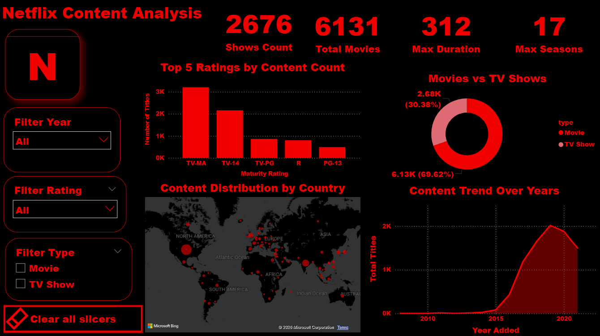

# Netflix Content Analysis
Netflix Content Analysis Dashboard
 Dashboard Preview

Project Overview
This project features a comprehensive Netflix Content Analysis dashboard built with Power BI. It explores over 8,800 titles to provide strategic insights into content distribution, audience demographics, and historical trends.

Key Performance Indicators (KPIs)
Total Movies: 6,131 (69.62% of total content)

Total TV Shows: 2,676 (30.38% of total content)

Maximum Duration: 312 Minutes for Movies

Maximum Seasons: 17 Seasons for TV Shows

Business Insights
Content Strategy: The library is heavily weighted toward Movies, comprising nearly 70% of the total catalog.

Audience Targeting: The top maturity ratings are TV-MA and TV-14, showing Netflix's focus on mature and young adult audiences.

Growth Peak: A significant upward trend in content additions began in 2015, reaching its peak around 2019-2020.

Geographic Reach: Significant content density is observed across North America and India.

Technical Stack
Power BI: Data visualization and interactive dashboard creation.

SQL: Data cleaning and transformation process (see Netflix_Queries.sql).

UI Design: Custom Netflix-themed dark mode for enhanced user experience.

Project Files
Netflix_Content_Analysis.pbix: The full Power BI project file.

Netflix_Queries.sql: SQL scripts for data preparation.

Netflix Content Analysis Image.PNG: Dashboard preview image.
